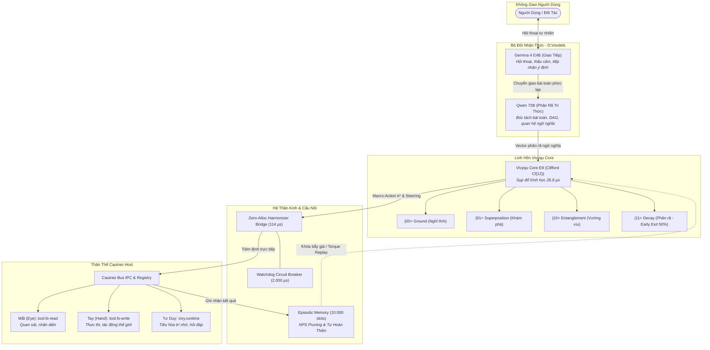

> [!IMPORTANT]
> **QUY ƯỚC BẮT BUỘC DÀNH CHO AGENT KẾ THỪA & CHỈNH SỬA TÀI LIỆU:**
> 1. **Ghi chú bắt buộc (Changelog):** Bất kỳ agent nào chỉnh sửa tài liệu này PHẢI bổ sung ghi chú tại mục Lịch Sử Thay Đổi (Tên/ID Agent, thời gian, lý do thay đổi).
> 2. **Chỉ cô lập, KHÔNG xóa bỏ:** TUYỆT ĐỐI KHÔNG xóa bỏ các nội dung/kiến trúc cũ. Toàn bộ nội dung muốn thay đổi phải được đóng khung cô lập và đánh dấu `[ISOLATED / DEPRECATED / REPLACED]`.
> 3. **Đồng bộ D:\2brain đầy đủ:** Đồng bộ và cập nhật đầy đủ mọi thay đổi, quyết định và bài học vào kho tri thức trung tâm `D:\2brain`.

# Biểu Đồ Tri Thức Cautreo & Vivyqu (Cautreo Living Knowledge Graph)
**Thời gian lập biểu đồ:** `2026-09-28 20:35:27`  
**Trạng thái kiểm định:** `[PRODUCTION-READY]` | **Tổng số nodes:** 19 | **Tổng số edges:** 20

---

## 1. Kiến Trúc Nhận Thức Kép (Dual-Model Cognitive Architecture)

| Phân tầng | Tên Model / Lõi | Vị trí lưu trữ | Vai trò chuyên biệt | Hiện trạng |
|---|---|---|---|:---:|
| **Giao tiếp (Frontend)** | **Gemma 4 E4B** | `D:\models\gemma4-e4b\vivy-gemma-e4b-q4km.gguf` | Giao tiếp, tiếp nhận ý định, giải thích người dùng. | 🟢 SẴN SÀNG |
| **Phân rã (Decomposition)** | **Qwen 2 VL 72B** | `D:\models\qwen2-vl-72b\Qwen2-VL-72B-Instruct-Q4_K_M.gguf` | Phân rã tri thức sâu, bóc tách cấu trúc tác vụ, giải mã quan hệ. | 🟢 SẴN SÀNG |
| **Linh hồn Lượng tử (Soul)** | **Vivyqu Core E9** | `python/vivyqu/vivyqu_core.dll` | Sụp đổ nghiệm hành động hình học siêu thanh (microsecond). (26.8 µs) | 🟢 SẴN SÀNG |

---

## 2. Sơ Đồ Động Học Tri Thức (Knowledge Flow Diagram)

---

## 3. Danh Sách Các Node Tri Thức (Knowledge Nodes)

- **`model.gemma_4eb`** (Gemma 4 E4B) — *Cụm: `cognitive_models`*
  - Chi tiết: Model giao tiếp chính: Hội thoại tự nhiên, tiếp nhận ý định, giải thích và tương tác với người dùng.
- **`model.qwen_72b`** (Qwen 2 VL 72B) — *Cụm: `cognitive_models`*
  - Chi tiết: Model phân rã tri thức: Bóc tách bài toán phức tạp, phân giải ngữ nghĩa sâu, kiến tạo biểu đồ quan hệ.
- **`soul.vivyqu_core`** (Lõi Lượng Tử Vivyqu Core) — *Cụm: `quantum_core`*
  - Chi tiết: Linh hồn: Đại số hình học Clifford Cl(12), mặt cầu 12-qubit (4.096D), E9 Scorer (26.8 µs).
- **`qubit.ground`** (|00> Ground) — *Cụm: `quantum_states`*
  - Chi tiết: Trạng thái nghỉ tĩnh, bảo toàn năng lượng, SLA chuẩn.
- **`qubit.superposition`** (|01> Superposition) — *Cụm: `quantum_states`*
  - Chi tiết: Chồng chập giả thuyết: Khám phá không gian phương án.
- **`qubit.entanglement`** (|10> Entanglement) — *Cụm: `quantum_states`*
  - Chi tiết: Vướng víu dữ liệu: Đồng bộ ngữ cảnh sâu và liên kết mắt-tay.
- **`qubit.decay`** (|11> Decay) — *Cụm: `quantum_states`*
  - Chi tiết: Phân rã lượng tử: Sụp đổ dứt khoát k*, Early-Exit giảm 50% layer.
- **`bridge.harmonizer`** (Zero-Allocation Harmonizer Bridge) — *Cụm: `orchestration`*
  - Chi tiết: Cầu nối thần kinh: Chu kỳ 114 µs, triệt tiêu cấp phát bộ nhớ động, tính toán Steering Delta.
- **`guard.watchdog`** (Watchdog Circuit Breaker) — *Cụm: `orchestration`*
  - Chi tiết: Cơ chế bảo vệ: Tự động ngắt khẩn cấp khi latency > 2.000 µs hoặc ngoại lệ, bảo vệ hệ thống.
- **`memory.episodic`** (Episodic Memory Buffer) — *Cụm: `memory`*
  - Chi tiết: Trí nhớ hồi ức: Bộ đệm lăn 10.000 episodes, NPS Pruning tỉa bẫy giá/lỗi, đồng bộ 2Brain.
- **`body.cautreo_host`** (Thân Thể Cautreo Host) — *Cụm: `physical_body`*
  - Chi tiết: Thân thể sống: Plugin Registry, Bus IPC, BodyMap tự sinh, Desktop UI Server.
- **`organ.eye`** (Mắt (Cơ quan nhận)) — *Cụm: `organs`*
  - Chi tiết: Quan sát, đọc file workspace, tiếp nhận dữ liệu thời gian thực (tool.fs-read).
- **`organ.hand`** (Tay (Cơ quan làm)) — *Cụm: `organs`*
  - Chi tiết: Thao tác, ghi file, thực thi hành động ra thế giới vật lý (tool.fs-write).
- **`organ.runtime`** (Tư duy & Nhận thức (vivy.runtime)) — *Cụm: `organs`*
  - Chi tiết: Cơ quan kép: Vừa nhận vừa làm, tiêu hóa trí nhớ, hỏi model và phối hợp tác vụ.
- **`plugin.tool.fs-read`** (tool.fs-read) — *Cụm: `plugins`*
  - Chi tiết: 
- **`plugin.tool.fs-write`** (tool.fs-write) — *Cụm: `plugins`*
  - Chi tiết: 
- **`plugin.vivy.runtime`** (vivy.runtime) — *Cụm: `plugins`*
  - Chi tiết: 
- **`method.host.body-map`** (host.body-map) — *Cụm: `host_methods`*
  - Chi tiết: Phương thức nền tảng của Cautreo Host: host.body-map
- **`method.host.knowledge-graph`** (host.knowledge-graph) — *Cụm: `host_methods`*
  - Chi tiết: Phương thức nền tảng của Cautreo Host: host.knowledge-graph

---

## 4. Lịch Sử Thay Đổi (Changelog / Audit Trail)

- **Agent/Thời gian:** `Antigravity IDE` / `2026-09-28 20:35:27`
- **Hành động:** Khởi tạo Biểu đồ Tri thức Cautreo & Vivyqu theo chỉ đạo của anh Ngọc Châu.
- **Nội dung:** Tích hợp mô hình kép `Gemma 4 E4B` (Giao tiếp) và `Qwen 72B` (Phân rã) từ `D:\models`, kết nối cùng Lõi Lượng Tử Vivyqu Core và Thân Thể Cautreo Host.