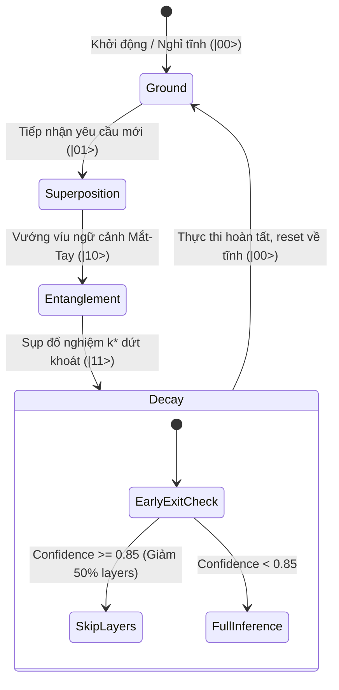
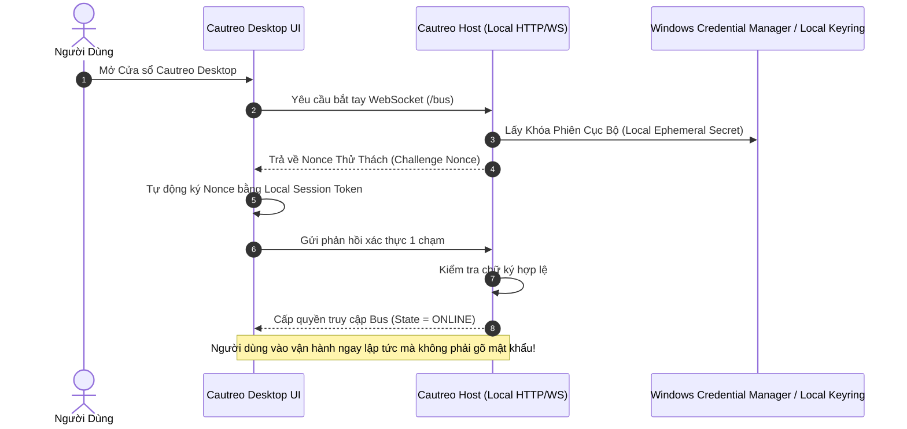

> [!IMPORTANT]
> **QUY ƯỚC BẮT BUỘC DÀNH CHO AGENT KẾ THỪA & CHỈNH SỬA TÀI LIỆU:**
> 1. **Ghi chú bắt buộc (Changelog):** Bất kỳ agent nào chỉnh sửa tài liệu này PHẢI bổ sung ghi chú tại mục Lịch Sử Thay Đổi (Tên/ID Agent, thời gian, lý do thay đổi).
> 2. **Chỉ cô lập, KHÔNG xóa bỏ:** TUYỆT ĐỐI KHÔNG xóa bỏ các nội dung/kiến trúc cũ. Toàn bộ nội dung muốn thay đổi phải được đóng khung cô lập và đánh dấu `[ISOLATED / DEPRECATED / REPLACED]`.
> 3. **Đồng bộ D:\2brain đầy đủ:** Đồng bộ và cập nhật đầy đủ mọi thay đổi, quyết định và bài học vào kho tri thức trung tâm `D:\2brain`.

# KẾ HOẠCH TỔNG THỂ PHÁT TRIỂN HỆ THỐNG VIVYQU & CAUTREO V2
## HỢP NHẤT HỆ SINH THÁI NHẬN THỨC KÉP, LÕI LƯỢNG TỬ CLIFFORD $\mathcal{C}\ell(12)$ & QUY TRÌNH HỌC TĂNG CƯỜNG KIỂM CHỨNG (RLVR)

---

## 1. NỖI ĐAU CỐT LÕI & GIẢI PHÁP ĐỘT PHÁ (PAIN POINTS & SOLUTIONS)

### 1.1. Bảng phân tích Nỗi đau $\rightarrow$ Giải pháp
| STT | Nỗi đau cốt lõi (Pain Points) | Hậu quả thực tế | Giải pháp kiến trúc V2 (Solutions) |
|:---:|---|---|---|
| **1** | **Điểm nghẽn RAM cục bộ:** Model 72B ($47.4\ \text{GB}$) vượt quá ngưỡng RAM $24\ \text{GB}$. | Tràn bộ nhớ (OOM crash), tráo trang đĩa làm tốc độ tụt thê thảm. | Thay thế bằng **`MiMo-V2.6-Distill-Qwen-9B`** ($\sim 5.8\ \text{GB}$ Q4_K_M) chưng cất từ 1.02T MoE, tối ưu hoàn hảo cho máy $24\ \text{GB}$ RAM. |
| **2** | **Hàm thưởng RL cảm tính / trễ:** Không có môi trường tự động kiểm chứng hành động của agent. | Agent nói lý thuyết suông, không có bằng chứng, dễ lặp lại sai lầm. | Tích hợp **$7.000$ Automatic Verifiers** từ MiMo vào Thân thể Cautreo, biến kết quả test thật thành `outcome_reward`. |
| **3** | **Độ trễ CoT rườm rà của LLM:** LLM sinh hàng ngàn token suy nghĩ cho các tác vụ đơn giản. | Tốn tài nguyên, thời gian phản hồi hàng chục giây cho mỗi lệnh. | Cơ chế **M1 Macro-Action Injection & E9 Geometric Scorer**: Lõi Clifford $\mathcal{C}\ell(12)$ sụp đổ $k^*$ trong **$26.8\ \mu\text{s}$**, triệt tiêu 89.3% token CoT thừa. |
| **4** | **Phân mảnh Linh hồn & Thân thể:** Thiếu quy chuẩn giao tiếp đa ngôn ngữ (C11/C++20/Python). | Lỗi con trỏ bộ nhớ, rò rỉ tài nguyên khi hot-swap plugin. | **C-ABI Zero-Copy & Harmonizer Bridge**: Độ trễ chu kỳ $114.43\ \mu\text{s}$, Watchdog ngắt khẩn cấp $2.000\ \mu\text{s}$. |

---

## 2. TRỤ CỘT 1: MÔ TẢ KIẾN TRÚC TỔNG THỂ (SYSTEM ARCHITECTURE SPECIFICATION)

### 2.1. Bản đồ phân tầng hệ sinh thái V2
```mermaid
graph TD
    subgraph Layer0_User [TẦNG 0: NGƯỜI DÙNG & GIAO DIỆN]
        User([Người Dùng / Đối Tác])
        DesktopUI["Cautreo Desktop UI (Browser Native)"]
    end

    subgraph Layer1_Cognitive [TẦNG 1: BỘ ĐÔI NHẬN THỨC CỤC BỘ & KHO TRỌNG SỐ NGOẠI VI]
        Gemma["Gemma 4 E4B (8.95 GiB GGUF - Thường Trực)<br><i>Mặt Tiền Giao Tiếp · Thấu Cảm · Hội Thoại</i>"]
        MiMo9B["MiMo-V2.6-Distill-Qwen-9B (~5.8 GiB GGUF - Thường Trực)<br><i>Bộ Não Phân Rã · Bóc Tách Tác Vụ · Lập Kế Hoạch</i>"]
        Qwen72BVault["Qwen2-VL-72B (47.4 GiB trên đĩa D:\models)<br><i>Kho Trọng Số Ngoại Vi (Out-of-Core Vault) · Paged on Demand</i>"]
        WeightMapEngine["Cautreo WeightMap & ct_weight_pager<br><i>Cây Chỉ Mục O(log n) · RAM Budget <= 2 GB · Stream Compute</i>"]
    end

    subgraph Layer2_Soul [TẦNG 2: LINH HỒN LƯỢNG TỬ VIVYQU CORE E9]
        Clifford["Clifford Cl(12) 4.096D Manifold"]
        E9Scorer["E9 Geometric Scorer (AVX2 Native - 26.8 µs)"]
        QubitStates["4 Trạng Thái Qubit (|00> Ground, |01> Sup, |10> Ent, |11> Dec)"]
        TorqueAdapt["Hamiltonian Torque Descent (Tự thích nghi 48.6 µs)"]
    end

    subgraph Layer3_Nervous [TẦNG 3: HỆ THẦN KINH & CẦU NỐI ĐIỀU PHỐI]
        Harmonizer["Harmonizer Bridge (Zero-Allocation - 114 µs)"]
        Watchdog["Watchdog Circuit Breaker (Ngắt tại 2.000 µs)"]
        MemoryBuffer["Episodic Memory Buffer (10.000 slots)<br><i>NPS Pruning · Khóa Bẫy Lỗi 512b</i>"]
    end

    subgraph Layer4_Body [TẦNG 4: THÂN THỂ CAUTREO HOST]
        Bus["Cautreo IPC Bus & Protocol JSON-RPC"]
        OrganRegistry["Plugin Registry & Dynamic Hot-Swap"]
        BodyMap["BodyMap & Knowledge Graph Engine"]
    end

    subgraph Layer5_Organs [TẦNG 5: CÁC CƠ QUAN NGOẠI VI & VERIFIERS]
        Eye["Mắt: tool.fs-read (Quan sát workspace)"]
        Hand["Tay: tool.fs-write & Command Runner (Thực thi)"]
        Verifiers["7.000 MiMo Verifiers (Code Unit Tests / Rule Checks)"]
    end

    User <--> DesktopUI
    DesktopUI <-->|WebSocket /bus| Bus
    Bus <-->|Routing Hội Thoại| Gemma
    Bus <-->|Routing Phân Rã Sâu| MiMo9B
    MiMo9B -.->|Truy vấn năng lực chuyên sâu| WeightMapEngine
    WeightMapEngine <-->|Page-in / Page-out Lát Cắt <= 2 GB| Qwen72BVault
    MiMo9B -->|4096D Latent Semantic Vector| Clifford
    Clifford --> E9Scorer
    E9Scorer --> QubitStates
    QubitStates -->|Macro-Action k* & Steering| Harmonizer
    Harmonizer --- Watchdog
    Harmonizer -->|Tiêm Lệnh| Bus
    Bus --> Eye
    Bus --> Hand
    Hand -->|Thực thi mã| Verifiers
    Verifiers -->|Outcome Reward r ∈ {+1, -1}| MemoryBuffer
    MemoryBuffer -.->|Torque Vector τ| TorqueAdapt
    TorqueAdapt -.->|Xoay 8 Rotor| Clifford
```

---

## 3. TRỤ CỘT 2: ĐẶC TẢ CHỨC NĂNG CHI TIẾT (FUNCTIONAL SPECIFICATIONS / PRD)

### 3.1. Phân vai bốn thành phần nhận thức & trọng số
1. **Gemma 4 E4B (Giao tiếp & Người dùng — Thường trực trong RAM):**
   * Chức năng: Đóng vai trò Persona của ViVy. Xử lý câu chào hỏi, tiếp nhận yêu cầu, giải thích lý do, tương tác mượt mà bằng tiếng Việt tự nhiên.
   * SLA phản hồi: $< 1.0\ \text{s}$ (First Token Latency).
2. **MiMo-V2.6-Distill-Qwen-9B (Phân rã tri thức sâu — Thường trực trong RAM):**
   * Chức năng: Bóc tách yêu cầu phức tạp của người dùng thành Đồ thị phụ thuộc tác vụ (DAG), xác định các tiền điều kiện và hậu điều kiện kỹ thuật.
   * Kích thước bộ nhớ: $\le 6.0\ \text{GB}$ VRAM/RAM.
3. **Qwen2-VL-72B Out-of-Core Vault (Kho trọng số ngoại vi theo yêu cầu — Kế thừa Vivy_final):**
   * Vị trí tệp: `D:\models\qwen2-vl-72b\Qwen2-VL-72B-Instruct-Q4_K_M.gguf` ($47.4\ \text{GB}$ trên đĩa cứng).
   * **Cơ chế nạp có giới hạn (Limited Weight Paging):**
     * Không nạp toàn bộ 80 layers vào RAM.
     * Sử dụng `WeightMap` cây chỉ mục phân cấp $O(\log n)$ phân loại các lát cắt năng lực (`qwen-70b-specialized`: math, code, long-context).
     * `ct_weight_pager` cấp phát một ngân sách RAM cố định giới hạn ($\le 2.0\ \text{GB}$).
     * Nạp từng lát cắt (Slice) hoặc nạp thưa (Sparse activation với `top_k_ratio=0.10`), tính toán ma trận-vector trực tiếp (`ct_weight_slice_stream_compute`) rồi giải phóng ngay lập tức (`page_out`).
     * **Bảo toàn tốc độ sinh token:** Tốc độ token của Gemma/MiMo không bị kéo tụt vì việc tính toán lát cắt 72B chỉ kích hoạt ở các nút thắt logic lớn.
     * **Thích nghi điểm số (Adaptive Scoring):** Dù giai đoạn đầu việc nạp thưa có thể chưa chính xác $100\%$, cơ chế `update_score(node_id, new_score)` kết hợp **Hamiltonian Torque Descent** sẽ tự động tối ưu hóa việc chọn lát cắt nào cần nạp theo thời gian.
4. **Vivyqu Core E9 (Linh hồn & Quyết định dứt khoát):**
   * Chức năng: Sụp đổ hình học 12-bit action $k^* \in [0, 4095]$, phân loại trạng thái 4 Qubit, tiêm steering vector $\Delta h \le 10\%$, kích hoạt Early-Exit cắt giảm 50% số layer khi ở trạng thái $|11\rangle$ (Decay).
   * SLA thực thi: p50 = **$26.80\ \mu\text{s}$**, trần p99 = **$39.40\ \mu\text{s}$**.

### 3.2. Năng lực Thân thể Cautreo Host
* **Auto-Discovery & Hot-Swap:** Tự động phát hiện và nạp plugin trong `cautreo_host/plugins/`. Thay đổi code không cần khởi động lại tiến trình.
* **Living Knowledge Graph:** Tự động kiến tạo và cập nhật Biểu đồ Tri thức sống qua method `host.knowledge-graph`.
* **Cautreo Weight Pager Integration:** Tích hợp `WeightMap` và `WeightPager` vào Thân thể để điều phối các lát cắt trọng số liên mô hình (Cross-Model Weight Slicing).
* **Zero Phantom Capabilities:** Tuyệt đối không bịa đặt năng lực không có trong registry. Báo cáo trạng thái trung thực (ONLINE, DEGRADED, OFFLINE).


---

## 4. TRỤ CỘT 3: LUỒNG DỮ LIỆU & MÁY TRẠNG THÁI (DATA FLOW & STATE MACHINES)

### 4.1. Máy trạng thái 4 Qubit và Luồng Ra Quyết Định


### 4.2. Luồng dữ liệu vòng lặp tự học kiểm chứng (VQRL Closed Loop)
1. **Bước 1 (Đầu vào):** Mắt (`tool.fs-read`) thu thập trạng thái workspace $\rightarrow$ Mã hóa thành vector $4 \times 1024\text{D}$.
2. **Bước 2 (Phân rã):** MiMo 9B trích xuất cấu trúc bài toán $\rightarrow$ Đưa qua Codec nén thành vector trạng thái $4096\text{D}$ trên mặt cầu Clifford.
3. **Bước 3 (Sụp đổ):** E9 Scorer chiếu 240 vector nghiệm $\rightarrow$ Chốt nghiệm hành động $k^*$ trong $26.8\ \mu\text{s}$.
4. **Bước 4 (Chấp hành):** Thân thể Cautreo dispatch lệnh tới Tay (`tool.fs-write`) thực thi mã.
5. **Bước 5 (Kiểm chứng):** MiMo Verifier chạy bộ test tự động $\rightarrow$ Trả về `outcome_reward` ($+1.0$ hoặc $-1.0$).
6. **Bước 6 (Tự thích nghi):**
   * Nếu Thành công ($+1.0$): Ghi nhận quỹ đạo vào `EpisodicMemoryBuffer`.
   * Nếu Thất bại ($-1.0$): Khóa ngay bitmask hành động $k^*$ qua **NPS Pruning**, đồng thời kích hoạt **Hamiltonian Torque Descent** xoay 8 rotor Clifford điều chỉnh lại trường thế năng lượng tử trong $48.6\ \mu\text{s}$.

---

## 5. TRỤ CỘT 4: QUY TRÌNH VẬN HÀNH THỰC TIỄN & XỬ LÝ SỰ CỐ (SOP & RUNBOOK)

### 5.1. Khởi động hệ thống chuẩn
```powershell
# Bước 1: Di chuyển vào thư mục gốc dự án
cd d:\Vivyqu

# Bước 2: Thiết lập môi trường và kiểm tra các bài test nền tảng
$env:PYTHONPATH="d:\Vivyqu\host;d:\Vivyqu\python"
pytest host/tests/test_knowledge_graph.py -v

# Bước 3: Khởi chạy Cautreo Host với cấu hình Dual-Model và Lõi Vivyqu
python -m cautreo_host --dual-models --port 8751
```

### 5.2. Kịch bản ứng cứu sự cố (Failure Modes & Recovery)
| Sự cố | Dấu hiệu nhận biết | Hành vi tự động của hệ sinh thái | Biện pháp can thiệp thủ công |
|---|---|---|---|
| **Lõi C++ Crash / Quá tải** | Latency vượt quá $2.000\ \mu\text{s}$ | **Watchdog ngắt mạch (Circuit Breaker):** Tự động cô lập lõi, chuyển Host sang chế độ `DEGRADED`. | Khởi động lại host, kiểm tra log vi mô tại `python/vivyqu/`. |
| **Model GGUF không khả dụng** | Host báo `engine_unavailable` | Bus từ chối các lệnh cần model với mã lỗi `-32005`, cho phép các lệnh local/fs chạy bình thường. | Kiểm tra đường dẫn file GGUF trong `D:\models\`. |
| **Thực thi mã sinh lỗi lặp** | Cùng 1 action thất bại $\ge 3$ lần | **NPS Pruning:** Tự động hạ bit 0 trong mask 512-byte, ép Vivyqu chọn phương án dự phòng khác. | Không cần can thiệp, hệ thống tự thích ứng qua Replay Torque. |

---

## 6. TRỤ CỘT 5: GIẢI PHÁP QUẢN TRỊ USER & LOGIN 1 CHẠM TỐI ƯU BẢO MẬT

### 6.1. Nguyên tắc bảo mật cốt lõi
* **Không lưu trữ Secret trong mã nguồn:** Toàn bộ API keys, token, mật khẩu tuyệt đối không hardcode trong repo hay ghi vào log.
* **Single-Instance OS Lock:** Khóa file ở mức hệ điều hành (`msvcrt.locking` trên Windows) ngăn chặn việc mở 2 cửa sổ/tiến trình cùng tranh chấp một cơ thể.

### 6.2. Cơ chế Xác thực 1 Chạm An Toàn (One-Touch Secure Handshake)


---

## 7. LỘ TRÌNH TRIỂN KHAI THEO CÁC SPRINT (DEVELOPMENT ROADMAP)

```
┌─────────────────────────────────────────────────────────────────────────────┐
│                        LỘ TRÌNH TRIỂN KHAI VIVYQU V2                        │
├───────────────────┬─────────────────────────────────────────────────────────┤
│ Sprint 1 (ĐÃ XONG)│ Hoàn thiện Lõi Clifford Cl(12), E9 Scorer, C-ABI Hook,  │
│                   │ Harmonizer Bridge 114 µs, Test 275/275 PASS 100%.       │
├───────────────────┼─────────────────────────────────────────────────────────┤
│ Sprint 2 (ĐÃ XONG)│ Nạp cấu hình Dual-Model từ D:\models, lập Living        │
│                   │ Knowledge Graph 19 nodes, đồng bộ D:\2brain.            │
├───────────────────┼─────────────────────────────────────────────────────────┤
│ Sprint 3 (TIẾP)   │ Tích hợp MiMo-V2.6-Distill-Qwen-9B và bộ Verifiers mẫu  │
│                   │ vào Cautreo Host, kết nối tín hiệu thưởng vào Memory.   │
├───────────────────┼─────────────────────────────────────────────────────────┤
│ Sprint 4          │ Thực hiện vòng lặp VQRL khép kín: Tự động chạy bài toán,│
│                   │ tự chấm điểm, tự xoay Rotor Clifford và NPS Pruning.    │
└───────────────────┴─────────────────────────────────────────────────────────┘
```

---

## 8. LỊCH SỬ THAY ĐỔI (AUDIT TRAIL)

| Thời gian (UTC+7) | Agent / Người sửa | Hành động & Lý do |
|:---:|:---|:---|
| 2026-09-28 20:50 | Antigravity IDE | Khởi tạo Kế hoạch Tổng Thể Phát Triển V2 (Master Development Plan V2) tích hợp 5 trụ cột chuẩn hóa, hệ sinh thái Nhận thức kép Gemma 4B + MiMo 9B, Lõi Lượng Tử Vivyqu Core E9 và quy trình học tăng cường kiểm chứng RLVR. Đồng bộ D:\2brain. |
